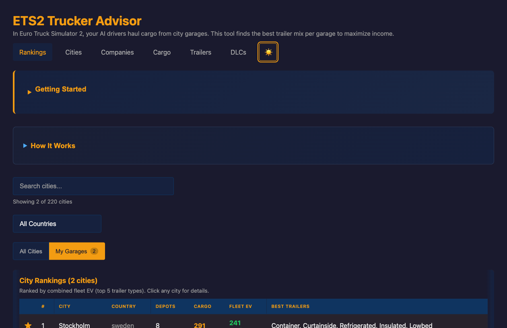
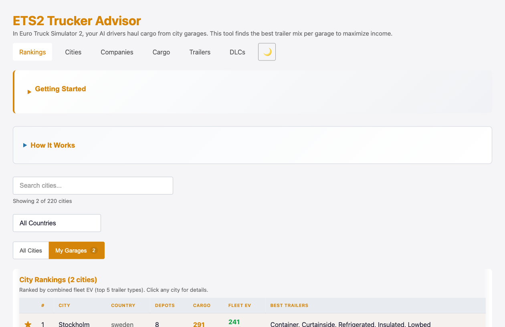
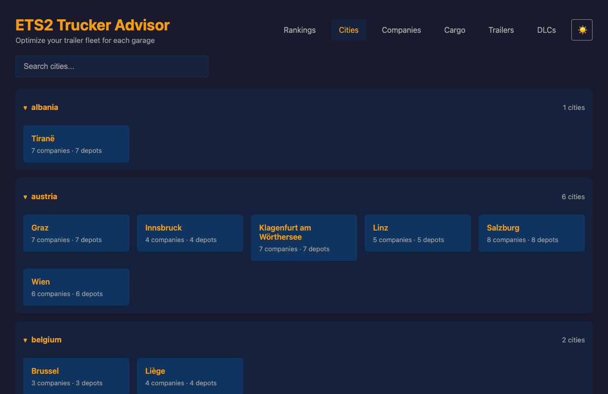
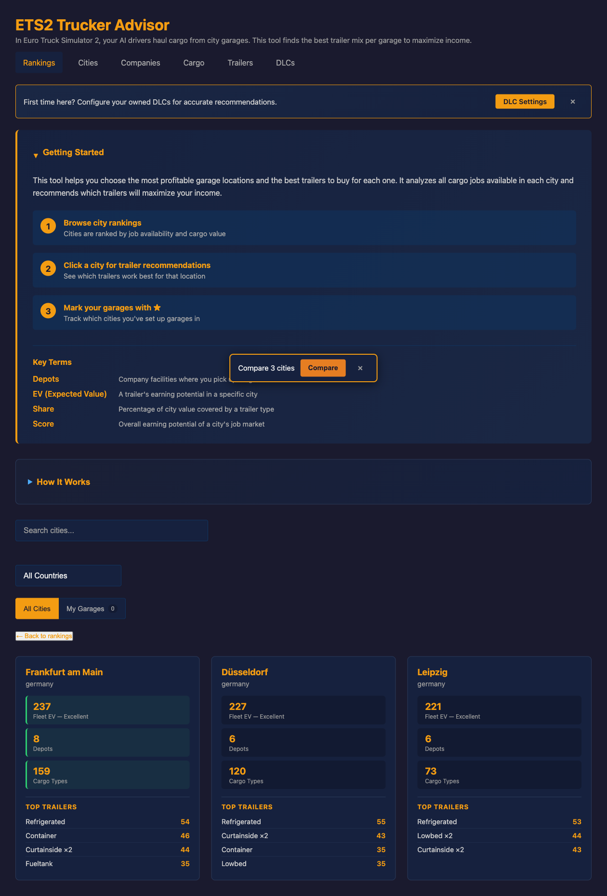
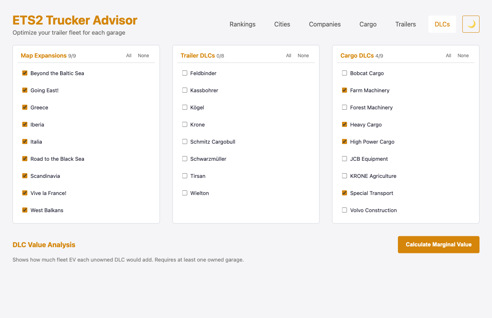

# ETS2 Trucker Advisor

Optimize your AI driver garages in Euro Truck Simulator 2. This tool analyzes every cargo job available in each city and recommends which trailers to buy to maximize your fleet's income.

**[Try it now](https://alexoq.github.io/trucker)**



## What It Does

You have garages across Europe. Each garage can hold up to 5 AI drivers. Each driver needs a trailer. But which trailer type earns the most at each location?

ETS2 Trucker Advisor answers that by:

- Analyzing **all cargo jobs** available at every company depot in each city
- Running a **Monte Carlo simulation** (20,000 rounds) to find the best fleet composition
- Ranking **all garage cities** by earning potential so you know where to expand next
- Accounting for **DLC content** — toggle which DLCs you own for accurate results

## Features

- **City Rankings** — all garage cities ranked by fleet earning potential, sortable by any column
- **Fleet Recommendations** — optimal trailer set for each city with expected value per driver
- **City Comparison** — compare up to 5 cities side-by-side ([shareable via URL](https://alexoq.github.io/trucker#compare=rotterdam,duisburg,hamburg))
- **DLC Marginal Value** — see which unowned DLC would improve your fleet the most
- **Dark/Light Mode** — theme toggle with system preference detection
- **Offline Support** — works offline after first visit
- **Data Export** — CSV, JSON, and clipboard export from any city detail view
- **Keyboard Accessible** — full keyboard navigation, screen reader support, WCAG AA compliant
- **Fully Client-Side** — no backend, no account, no tracking. Runs entirely in your browser.

## Screenshots

<details>
<summary>Light mode - rankings</summary>


</details>

<details>
<summary>Dark mode - city browser</summary>


</details>

<details>
<summary>City comparison</summary>


</details>

<details>
<summary>DLC settings</summary>


</details>

## Getting Started

Just visit **[alexoq.github.io/trucker](https://alexoq.github.io/trucker)** and:

1. Set up your owned DLCs on the [DLCs page](https://alexoq.github.io/trucker/dlcs.html)
2. Browse city rankings on the main page
3. Click any city for fleet recommendations
4. Star your owned garages to filter the view

## How It Works

Each city has company depots that spawn random cargo jobs. Each cargo type has a spawn probability and is compatible with specific trailer body types. The advisor:

1. **Builds a cargo profile** for every depot in every city
2. **Eliminates dominated trailer types** — if trailer A can haul everything trailer B can (and more), B is dropped
3. **Simulates 20,000 job boards** per city using Monte Carlo methods
4. **Greedily selects drivers** — each round picks the trailer type that adds the most marginal expected value
5. **Ranks cities** using an analytical formula for speed (no simulation needed per city)

For more detail on the algorithm and game mechanics, see [docs/ALGORITHM-NOTES.md](docs/ALGORITHM-NOTES.md).

## Data Source

Game data is extracted directly from game definition files for both Euro Truck Simulator 2 and American Truck Simulator using the included parser (`scripts/parse-game-defs.ts /path/to/def --game <ets2|ats>`). The parser reads cargo definitions, trailer specs, company mappings, economy constants, and DLC registries from the `def/` folder extracted from each game's `.scs` archives, and writes per-game JSON to `public/data/<game>/game-defs.json`. Data is updated when new game patches or DLCs are released.

## Development

```bash
npm install              # Install dependencies
npm run dev:frontend     # Start dev server (http://localhost:5173)
npm run build:frontend   # Build for production
npm run test             # Run tests (265 tests)
npm run lint             # TypeScript type checking
```

## Tech Stack

- **TypeScript + Vite** — build and bundling
- **Web Workers** — non-blocking Monte Carlo simulation
- **Service Worker** — offline caching (network-first for data, cache-first for assets)
- **GitHub Pages** — hosting
- No frameworks, no backend, no runtime dependencies

## Contributing

See [CONTRIBUTING.md](CONTRIBUTING.md) for guidelines on reporting issues, fixing data, and contributing code.

## License

[MIT](LICENSE)

## Acknowledgments

- Game data from Euro Truck Simulator 2 by [SCS Software](https://www.scssoft.com/)
- Community contributors who help maintain data accuracy
