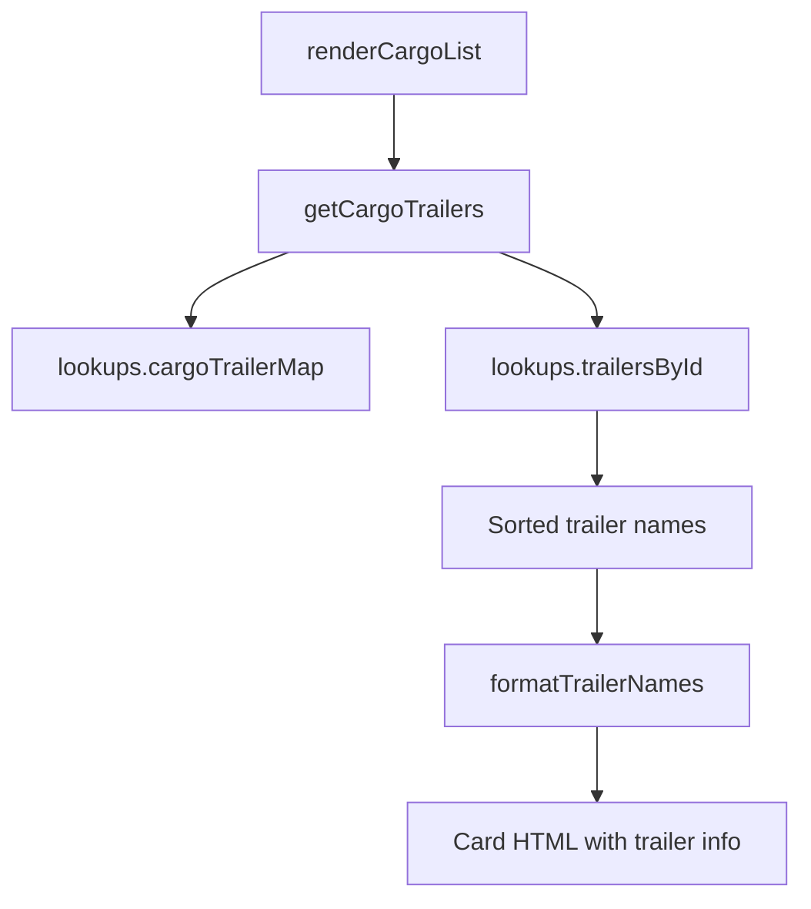

# Design: cargo-trailer-links

## Overview
Add trailer name display to cargo card rendering by reusing existing `getCargoTrailers()` function and inserting formatted string into card subtitle.

## Architecture

## Components

### Component A: Trailer Name Formatter
**Purpose**: Format trailer list for display on card
**Responsibilities**:
- Accept array of trailer objects
- Return formatted string: "Hauls on: T1, T2, T3" or "Hauls on: T1, T2, +3 more"
- Handle empty array gracefully

### Component B: Card Renderer Enhancement
**Purpose**: Integrate trailer info into existing card HTML
**Responsibilities**:
- Call `getCargoTrailers(cargo.id)` for each card
- Call formatter to get display string
- Append to existing `.card-subtitle` content

## Data Flow

1. User loads `/cargo.html`
2. `renderCargoList()` iterates cargo items
3. For each cargo:
   - Existing: `getCargoStats(cargo.id)` → providers, cityCount
   - **New**: `getCargoTrailers(cargo.id)` → trailer array
   - **New**: `formatTrailerNames(trailers)` → display string
4. Render card HTML with trailer info
5. Display to user

## Technical Decisions

| Decision | Options | Choice | Rationale |
|----------|---------|--------|-----------|
| Display format | Inline \| Tooltip \| Expandable | Inline | Simpler, matches provider format |
| Truncation | Show all \| Max 3 \| Max 5 | Max 3 | Balance info density with readability |
| Excluded cargo | Show nothing \| Show "N/A" | Show nothing | Less clutter for special case |
| Styling | New class \| Reuse `.card-subtitle` | Reuse | Consistency with existing design |

## File Structure

| File | Action | Purpose |
|------|--------|---------|
| `/public/cargo.html` | Modify | Add `formatTrailerNames()` function, update card HTML template |

## Error Handling

| Error | Handling | User Impact |
|-------|----------|-------------|
| Empty trailer list | Skip rendering trailer line | Card shows no trailer info |
| Missing trailer data | Filter out nulls in `getCargoTrailers()` | Show only valid trailers |
| Excluded cargo | Check `cargo.excluded`, skip trailer line | Consistent with detail view |

## Existing Patterns to Follow
- **Card subtitle format**: Multi-line allowed, separator "·" used (`cargo.html:140`)
- **Truncation pattern**: Used in city stats "X depots, Y cargo types" (not truncated but could be)
- **Conditional rendering**: Tags only show if `cargo.high_value || cargo.fragile` (`cargo.html:143-148`)
- **Data lookup**: `getCargoTrailers()` already exists and used in detail view (`cargo.html:63-70`)
