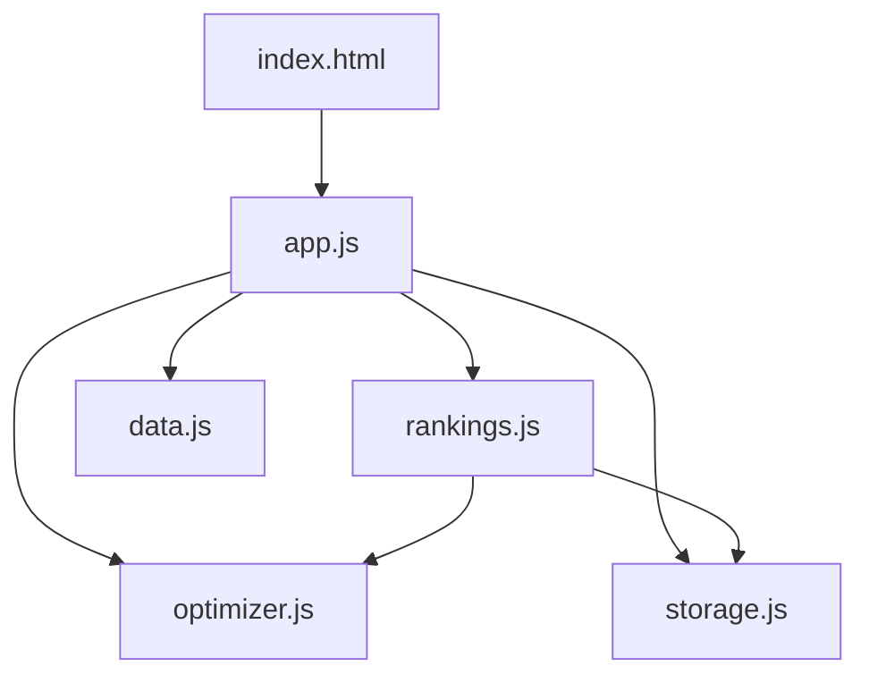

# Design: extract-js

## Overview
Extract inline script to 2 modules (app.js, rankings.js) following existing ES6 module pattern.

## Architecture

## Components

### app.js (UI Controller)
**Purpose**: Coordinate UI interactions, event handlers, navigation
**Responsibilities**:
- Initialize app (init function)
- Handle slider changes (onSliderChange)
- Manage search input (citySearch.addEventListener)
- Country filter dropdown (toggleDropdown, renderCountryCheckboxes)
- Settings toggle (settingsToggle)
- Hash navigation (handleHashNavigation)
- Export: init function

### rankings.js (View Renderer)
**Purpose**: Render rankings table and city detail views
**Responsibilities**:
- renderRankings() - city rankings table
- renderCity(cityId) - city detail view
- showCity(cityId), showRankings() - view switching
- formatRank(), getCityRank() - utility functions
- Export: { renderRankings, renderCity, showCity, showRankings }

## Data Flow

1. index.html loads, imports app.js as module
2. app.js imports rankings.js, data.js, optimizer.js, storage.js
3. app.init() loads data, sets up event handlers
4. User interaction → app.js event handler → rankings.js view update

## Technical Decisions

| Decision | Options | Choice | Rationale |
|----------|---------|--------|-----------|
| Module count | 1 vs 2 files | 2 files (app.js, rankings.js) | Clear separation: UI vs rendering |
| Import style | Named vs default | Named exports | Matches existing pattern |
| Bootstrap | Zero vs minimal | Minimal (init call) | Clean separation, testable init |

## File Structure

| File | Action | Purpose |
|------|--------|---------|
| public/js/app.js | Create | UI controller and event handlers |
| public/js/rankings.js | Create | View rendering logic |
| public/index.html | Modify | Remove inline script, add module imports |

## Error Handling

| Error | Handling | User Impact |
|-------|----------|-------------|
| Module load failure | showError() in init | Error message displayed |
| Data load failure | Try/catch in init | Error message with details |

## Existing Patterns to Follow
- ES6 module syntax: `export { fn }` and `import { fn } from './file.js'`
- Cache busting: `?v=X` in import URLs
- Error states: showError() with user-friendly messages
